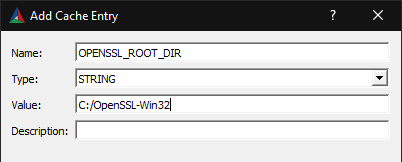
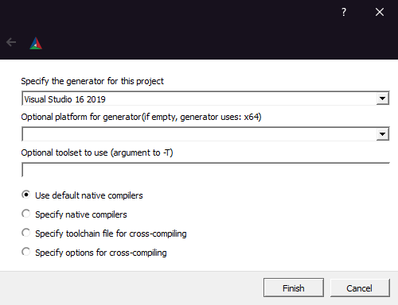

# Building Etterna

Interested in contributing to Etterna? This guide is the place to start!

## Table of Contents

- [Getting Started](#Getting-Started)
- [Quick Start](#Quick-Start)
- [Universal Dependencies](#Universal-Dependencies)
  - [Linux Dependencies](#Linux-Dependencies)
  - [Windows Dependencies](#Windows-Dependencies)
  - [macOS Dependencies](#macOS-Dependencies)
- [Project Generation](#Project-Generation)
  - [CLI Project Generation](#CLI-Project-Generation)
  - [GUI Project Generation](#GUI-Project-Generation)
- [Compiling](#Compiling)
  - [Ninja](#Ninja)
  - [Linux](#Linux)
  - [macOS](#macOS)
  - [Windows](#Windows)
- [Distribution](#Distribution)
- [Static Analysis](#Static-Analysis)
  - [cppcheck](#cppcheck)
- [Documentation](#Documentation)
  - [C++](#C++-Docs)
  - [LDoc](#LDoc)

## Getting Started

To begin, take a look at what [dependencies](#Universal-Dependencies)
you're going to need to start compiling. Etterna is cross-platform on Linux, macOS, and Windows. Typically, we work off of the `develop` branch, therefore all pull requests should be made towards `develop`.

## Quick Start

Here are some commands for current developers and contributors to get started. More are listed at [Sample CMake Commands](#Sample-CMake-Commands).

```bash
cmake -G "Unix Makefiles" ..                                                        # Linux
cmake -DOPENSSL_ROOT_DIR="/usr/local/opt/openssl" -G "Xcode" ..                     # macOS
cmake -DOPENSSL_ROOT_DIR="C:/OpenSSL-Win64" -G "Visual Studio 16 2019" -A x64 ..    # Windows
```

## Universal Dependencies

- [CMake](https://cmake.org/download/) (Minimum version 3.14.0) - It is recommended to get this package from the CMake website as many package managers do not have the latest version. Check your package manager before trying.
- [OpenSSL](https://www.openssl.org/) (Version 1.1.0)
  - Debian: `apt install libssl-dev`
  - Fedora: `dnf install openssl-devel`
  - macOS: `brew install openssl`
  - Windows: A CMake compatible version of OpenSSL is available at [Shining Light Productions](https://slproweb.com/products/Win32OpenSSL.html) website. You will need the 32bit and 64bit installers. Direct links: [32bit](https://slproweb.com/download/Win32OpenSSL-1_1_0j.exe), [64bit](https://slproweb.com/download/Win64OpenSSL-1_1_0j.exe)

### Linux Dependencies

While most dependencies for macOS and Windows are included in the repo, there are some linux libraries which cannot be included in the repo.

- Debian: `apt install libssl-dev libx11-dev libxrandr-dev libcurl4-openssl-dev libglu1-mesa-dev libpulse-dev libogg-dev libasound-dev libjack-dev`
- Fedora: `dnf install libssl-devel libX11-devel libcurl-devel mesa-libGLU-devel libXrandr-devel libogg-devel pulseaudio-libs-devel alsa-lib-devel jack-audio-connection-kit-devel`

### Windows Dependencies

- [Visual Studio](https://visualstudio.microsoft.com/downloads/) - Any modern version of Visual Studio should be compatible _(The earliest version we theoretically support is `Visual Studio 9 2008`, though we have only tested on `Visual Studio 15 2017` and after)_
- [DirectX Runtimes](https://www.microsoft.com/en-us/download/details.aspx?id=8109) (June 2010)
- [DirectX SDK](https://www.microsoft.com/en-us/download/details.aspx?id=6812)
- [Microsoft Visual C++ Redistributables](http://www.microsoft.com/en-us/download/details.aspx?id=48145) - Both 32bit and 64bit
- [Windows 10 Development Kit](https://developer.microsoft.com/en-us/windows/downloads/windows-10-sdk)

### macOS Dependencies

macOS has no other unique dependencies.

## Project Generation

First, ensure you have forked Etterna, cloned to your system, and checked out `develop`. 

There are two stages apart of CMake projects.

1. Configuration: CMake will run through all CMakeLists.txt and ensure all code processes.
2. Generation: CMake will take information from generation, and create the project files based on what was selected through the generation option.

### CLI Project Generation

Both configuration and generation stages automatically happen one after the other when using the CLI.
Start by creating a folder to hold all the output object files, usually called `build`, within the root of the project.

```bash
mkdir build && cd build
```

Etterna has game resources in the root of the project, so the output binary is either placed in the root of the project *(Unix)* or in the `Program` folder in the project root *(Windows)*.

To generate project files, run the CMake command below in the build directory with proper `GENERATOR`, `ARCHITECTURE` and `SSL_DIRECTORY` values:

- `GENERATOR`: The generator you are choosing to use. Supported generators are listed below.
- `ARCHITECTURE`: The target architecture. Currently we support `Win32` and `x64`. This parameter is only necessary if using a Visual Studio generator.
- `SSL_DIRECTORY`: The root directory of your OpenSSL install. This is required on Windows as it doesn't come with developer libraries for OpenSSL installed, and my be required on macOS depending on the OpenSSL version which comes with your system _(thought we recommend getting the latest version from homebrew)_.

```bash
cmake -G "GENERATOR" -A "ARCHITECTURE" -DOPENSSL_ROOT_DIR="SSL_DIRECTORY" ..
```

We actively support the following CMake generators

- macOS: `Ninja`, `Xcode`, `Unix Makefiles`
- Linux: `Ninja`, `Unix Makefiles`
- Windows: `Ninja`, `Visual Studio 15 2017`, `Visual Studio 16 2019` _(Technically, with how the CMake script is setup, any generator as far back as_ `Visual Studio 9 2008` _should work), but it has only tested it with the above three._

For the `OPENSSL_ROOT_DIR` parameter, set the directory for where ever the openssl root directory is located. Here are possible options

- Windows: `C:/OpenSSL-Win32` or `C:/OpenSSL-Win64` if followed above install instructions for OpenSSL
- macOS: `/usr/local/opt/openssl` or otherwise depending on your setup (if you're using HomeBrew, MacPorts or installed in from source)
- Linux: This parameter is not necessary on linux. (CMake can find it on it's own)

#### Sample CMake Commands

```bash
cmake -G "Ninja" ..                                                                 # Linux Ninja
cmake -G "Unix Makefiles" ..                                                        # Linux Makefiles
cmake -DOPENSSL_ROOT_DIR="/usr/local/opt/openssl" -G "Xcode" ..                     # macOS Xcode
cmake -DOPENSSL_ROOT_DIR="/usr/local/opt/openssl" -G "Ninja" ..                     # macOS Ninja
cmake -DOPENSSL_ROOT_DIR="/usr/local/opt/openssl" -G "Unix Makefiles" ..            # macOS Ninja
cmake -DOPENSSL_ROOT_DIR="C:/OpenSSL-Win32" -G "Visual Studio 16 2019" -A Win32 ..  # 32bit Windows
cmake -DOPENSSL_ROOT_DIR="C:/OpenSSL-Win64" -G "Visual Studio 16 2019" -A x64 ..    # 64bit Windows
```

### GUI Project Generation

In order to compile properly, you will want to make your CMake-GUI look similar to the above photo. The first text field is the location where you cloned Etterna, the second text field is where you want to place the build object files. The `OPENSSL_ROOT_DIR` was added by clicking the add entry button. It should look similar to the following image.


**NOTE**: Setting `OPENSSL_ROOT_DIR` is unnecessary for linux users as CMake will find the location of OpenSSL on it's own.



**Windows Users**: Remember to change the value to correspond to the correct 32bit or 64bit version of the OpenSSL library.

Once `OPENSSL_ROOT_DIR` is added, click the buttons labeled `Configure`. The first time this button is clicked (and a `CMakeCache.txt` does not exit in the build directory), CMake will ask about what generator you would like to use. If a Visual Studio generator is chosen, you should also ensure the `Optional platform for generator` field is not empty. Select `x64` for 64bit and `Win32` for 32bit. Once `Finish` is clicked, the project will begin configuring.



Finally, click `Generate` and you are ready to start coding.

## Compiling

### Ninja

The ninja command used is exactly the same across all operating systems. It should be noted that Ninja can only build 64bit binaries ([unless you would like to compile Ninja yourself](https://github.com/ninja-build/ninja/issues/1339)).

To install ninja, use one of the following commands

- Debian: `apt install ninja-build`
- Fedora: `dnf install ninja-build`
- macOS: `brew install ninja`

To start compiling, run the cmake command with the Ninja generator, then run `ninja`.

### Linux

Run `make` or `ninja` corresponding to the CMake generator you used.

### macOS

#### Xcode Editor

Open the `Etterna.xcodeproj` file generated within the build directory, select the Etterna target, and you are ready to start coding.

#### Xcode CLI

```bash
xcodebuild -project Etterna.xcodeproj -configuration Release
```

Due to the extreme verbosity of `xcodebuild`, we recommend [xcpretty](https://github.com/xcpretty/xcpretty) to clean up the output.

### Windows

#### Visual Studio Editor

Open the `Etterna.sln` file generated within the build directory, and you are ready to start coding.

#### Visual Studio CLI

If you prefer the command line, these commands should be what you are looking for. Make sure you run the proper visual studio command prompt.

```bash
msbuild Etterna.sln /p:Platform="Win32" /p:Configuration="Release"  # Only for 32bit CMake generator
msbuild Etterna.sln /p:Platform="x64"   /p:Configuration="Release"  # Only for 64bit CMake generator
```

## Distribution

We use CMake's CPack module to build distribution files. Currently, we create distribution binaries for Windows and macOS.

**Windows only prerequisite**: Install the latest version of [Nullsoft Scriptable Install System](https://nsis.sourceforge.io/Main_Page)

To build a distribution file for the operating system you are using, run `cpack` in the build directory after compiling.

## Static Analysis

### cppcheck

cppcheck is a cross-platform static analysis tool which CMake supports by adding a target for it in your desired generator. The target named `cppcheck` will only be created if CMake can find the cppcheck command on your system. 

- macOS: `brew install cppcheck`
- Debian: `apt install cppcheck`
- Windows: An installer is available at the [cppcheck website](http://cppcheck.sourceforge.net/). Make sure that `cppcheck` runs when you enter the command in your CLI. If it doesn't, [check your system/user path](https://www.computerhope.com/issues/ch000549.htm) to ensure that the bin folder of where you installed cppcheck is listed there.

When cppcheck is run, it will generate a file in the build directory called `cppcheck.txt` which will have the output of the command. The output is saved to a file as the command produces significant output, and can take some time to run.

To run `cppcheck`, run the target. Running the target will be different depending on the generator you have chosen. 

## Documentation

### C++ Docs

Etterna uses [doxygen](http://www.doxygen.nl/) to build it's C++ documentation. Documentation is generated in a `doxygen` directory, inside the build directory. CMake is setup to make a target called `doxygen` if the executable found in the path.

- macOS: `brew install doxygen`
- Debian: `apt install doxygen`
- Windows: An installer is available at the [doxygen website](http://www.doxygen.nl/download.html). As with [cppcheck](#cppcheck), make sure the executable binary directory is added to your path.

Doxygen within CMake is able to use [graphviz](https://www.graphviz.org/download/) to generate better looking relationship/hierarchy graphs. You can see how to download it for your operating system at the [graphgiz download page](https://www.graphviz.org/download/).

### LDoc

Etterna uses [LDoc](https://github.com/stevedonovan/LDoc) to generate Lua documentation. We reccomend installing [LuaRocks](https://github.com/luarocks/luarocks), and then installing LDoc through LuaRocks. Similar to Doxygen, it will only create the `ldoc` target if it can find the `ldoc` command in your system path.
